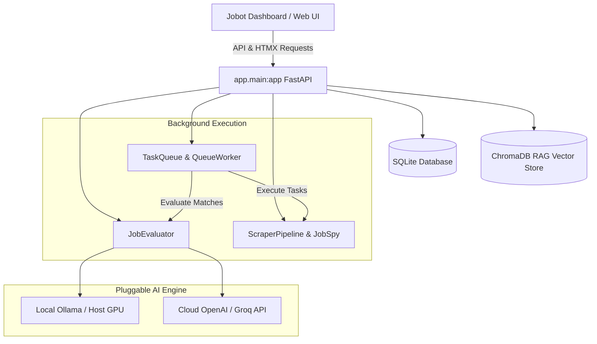

# Jobot 🤖💼 — Open-Source AI Job Search Copilot

<div align="center">

[](https://www.python.org/)
[](https://fastapi.tiangolo.com/)
[](https://htmx.org/)
[](https://tailwindcss.com/)
[](https://ollama.com/)
[](https://www.trychroma.com/)
[](LICENSE)
[](docs/CONTRIBUTING.md)

**An intelligent, self-hosted, privacy-first AI job search aggregator and application tracking copilot.**  
*Built with pure Python, local Ollama / RAG vector embeddings, Playwright scrapers, and a modern HTMX web dashboard.*

[User Manual](docs/USER_MANUAL.md) • [Contributing Guide](docs/CONTRIBUTING.md) • [Security Policy](SECURITY.md) • [Architecture](#-architecture-overview)

</div>

---

## 📋 Table of Contents
- [✨ Key Features](#-key-features)
- [🚀 Quickstart Guide](#-quickstart-guide)
  - [Option A: Docker Compose with Host Ollama (Recommended)](#option-a-docker-compose-with-host-ollama-recommended)
  - [Option B: Full Docker Stack](#option-b-full-docker-stack)
  - [Option C: Local Python Setup](#option-c-local-python-setup)
  - [📱 Secure Phone Access via SSH Tunnel](#-secure-phone-access-via-ssh-tunnel)
- [🖼️ Dashboard & Interface Tour](#%EF%B8%8F-dashboard--interface-tour)
- [⚙️ Environment Variables Reference](#%EF%B8%8F-environment-variables-reference)
- [🏗️ Architecture Overview](#%EF%B8%8F-architecture-overview)
- [🤝 Contributing & Community](#-contributing--community)
- [🛡️ Security & Privacy](#%EF%B8%8F-security--privacy)
- [📄 License](#-license)

---

## ✨ Key Features

- **⚡ Continuous Background Task Queue**: SQLite-backed asynchronous queue (`ScrapeTask`) and background worker daemon that scrapes, filters, and scores job opportunities continuously while you focus on work.
- **🔒 Local & Privacy-First AI (0 Cost)**: Powered by local Ollama (`llama3.1`, `qwen2.5`, `job-searcher-qwen3`, `nomic-embed-text`) with native **GPU & NPU hardware acceleration** (NVIDIA CUDA, AMD ROCm/DirectML, Intel Arc/NPU). Zero API costs, zero data leakage. (Optionally supports Cloud AI like OpenAI/Groq).
- **🌐 Multi-Platform Job Scraping**: Automated multi-source scraping across **LinkedIn**, **StepStone**, and **Google Jobs** via `python-jobspy` and Playwright with automated SHA-256 deduplication and anti-bot rate-limiting.
- **🎯 Profile-Grounded Skill Search**: AI Query Strategist dynamically synthesizes Boolean search query matrices combining candidate target roles and active skills directly from uploaded CVs or profile data.
- **📊 Normalized Multi-Factor Fit Scoring (0–100%)**: Ranks matches using normalized sub-factors: Skills Overlap Ratio (primary weight), Target Role & Seniority, Workplace & Location Preference, Experience Relevance, and ChromaDB Dense Vector RAG Similarity.
- **🎛️ UI Parameter Calibration Sliders**: Interactive UI sliders in Settings allow real-time tuning of parameter weights (Skills, Title, Location, Experience, Vector RAG) with a 1-click action button to rescore all stored jobs.
- **🧹 Zero-Noise Auto-Purging**: Automatically purges non-matching jobs (0% skill overlap or blacklisted rules) from your database to keep your pipeline 100% relevant.
- **📝 1-Click AI Cover Letter & Resume Tailoring**: Generates custom cover letters in 4 distinct professional tones (Professional, Direct, Enthusiastic, Conversational) and ATS-optimized accomplishment bullet points.
- **📋 Pure-Python Web Interface**: Dark-mode dashboard featuring an 8-stage Kanban board (`Seen`, `Applied`, `1st Interview`, `Not a Fit`, etc.), Data Table, Profile Editor, and real-time **AI Queue Control Center**.

---

## 🚀 Quickstart Guide

### Option A: Docker Compose with Host Ollama (Recommended)
Connects Jobot directly to your host machine's Ollama installation for native GPU/NPU acceleration with zero extra downloads:

```powershell
# Windows PowerShell
.\scripts\manage.ps1 docker-up-host-ollama
```

```bash
# Linux / macOS
./scripts/manage.sh docker-up-host-ollama
```
Open **[http://localhost:8000](http://localhost:8000)** in your browser.

---

### Option B: Full Docker Stack
Launches both Jobot and an isolated Ollama container together in Docker:

```powershell
# Windows PowerShell
.\scripts\manage.ps1 docker-up
```

```bash
# Linux / macOS
./scripts/manage.sh docker-up
```

---

### Option C: Local Python Setup

```bash
# 1. Clone repository
git clone https://github.com/Mahmoud-Eltabakh/jobot.git
cd Jobot

# 2. Create and activate virtual environment
python -m venv .venv
# On Windows PowerShell:
.\.venv\Scripts\Activate.ps1
# On Linux/macOS:
source .venv/bin/activate

# 3. Install dependencies & Playwright browser binaries
pip install -r requirements.txt
playwright install chromium

# 4. Copy environment configuration
cp .env.example .env

# 5. Start web server
uvicorn app.main:app --reload --host 127.0.0.1 --port 8000
```

### 📱 Secure Phone Access via SSH Tunnel

If you want to use Jobot from a phone or secondary device while keeping the app, database, queue, and local Ollama stack on your main workstation, use an SSH tunnel instead of exposing Jobot to the public internet.

This is the recommended mobile access pattern for privacy-first use:

- Jobot continues to run on the main machine
- SQLite, ChromaDB, AI models, and scrapers stay local
- The phone connects through an encrypted SSH tunnel
- No public port is opened on the host or router

#### SSH tunnel example

```powershell
# On the main host machine (Windows PowerShell)
ssh -N -L 8000:127.0.0.1:8000 your-user@your-server-or-host
```

```bash
# On Linux/macOS
ssh -N -L 8000:127.0.0.1:8000 your-user@your-server-or-host
```

Then open the UI in the browser on the phone using the host's reachable endpoint, or use a trusted local/private network path that allows the tunnel to work. The app remains the same local Jobot instance; the phone is only a secure client endpoint.

#### Security checklist

- Use SSH key-based authentication instead of passwords
- Keep host key verification enabled
- Restrict the tunnel to the exact Jobot port only
- Avoid opening inbound ports on your firewall or router
- Use a private trusted network where possible
- Stop the tunnel when you are done and verify the app is still local-only

---

## 🖼️ Dashboard & Interface Tour

| Tab / View | Description |
|---|---|
| **Kanban Board** | Visual 8-stage pipeline (`Seen`, `Applied`, `Waiting`, `1st Interview`, `2nd Interview`, `Final Round`, `Not a Fit`, `Rejected`). |
| **Data Table** | Sortable tabular view displaying job postings, match percentages, compensation, locations, and source platforms. |
| **AI Queue** | Real-time control center to monitor background task execution (`scrape_query`, `evaluate_job`, `full_discovery`), pause/resume worker, retry failed jobs, or clear queue. |
| **Profile & CV** | Upload PDF/DOCX resumes, manage core skills matrix, generate professional AI bios, and sync LinkedIn profiles using `li_at` session cookie. |
| **Settings** | Configure Ollama / OpenAI models, adjust fine-tuning parameter scoring weights, and manage blacklist rules. |

---

## ⚙️ Environment Variables Reference

| Variable Name | Default Value | Description |
|---|---|---|
| `APP_NAME` | `Jobot` | Application branding title |
| `ENV` | `development` | Runtime environment (`development` / `production`) |
| `DEBUG` | `true` | FastAPI debug mode |
| `HOST` | `127.0.0.1` | Web server bind address |
| `PORT` | `8000` | Web server listening port |
| `DATABASE_URL` | `sqlite:///data/jobot.db` | SQLite database connection string |
| `CHROMA_DIR` | `data/chroma` | Persistent ChromaDB vector store directory |
| `AI_PROVIDER` | `ollama` | Active AI provider (`ollama`, `openai`, `custom`) |
| `OLLAMA_BASE_URL` | `http://localhost:11434` | Ollama HTTP endpoint URL |
| `OLLAMA_MODEL` | `llama3.1:8b` | Ollama LLM model for job match evaluation |
| `OLLAMA_EMBED_MODEL` | `nomic-embed-text` | Ollama embedding model for ChromaDB RAG |
| `OPENAI_API_KEY` | `""` | Optional Cloud AI API Key |
| `OPENAI_BASE_URL` | `https://api.openai.com/v1` | Optional Cloud AI base URL |
| `OPENAI_MODEL` | `gpt-4o-mini` | Optional Cloud AI LLM model |

---

## 🏗️ Architecture Overview



---

## 🤝 Contributing & Community

Contributions are warmly welcomed! Jobot is a community-driven open-source project.

- **Developer Setup & Architecture**: Read our comprehensive [Contributor Guide](docs/CONTRIBUTING.md).
- **Submitting Bugs / Features**: Open an issue using our [Bug Report](.github/ISSUE_TEMPLATE/bug_report.md) or [Feature Request](.github/ISSUE_TEMPLATE/feature_request.md) templates.
- **Pull Requests**: Submit a PR following our [Pull Request Checklist](.github/PULL_REQUEST_TEMPLATE.md). All changes must include unit tests and pass `pytest`.

---

## 🛡️ Security & Privacy

Jobot is built privacy-first:
- When configured with local Ollama, **100% of your data stays on your machine**.
- Resumes, candidate profiles, and job descriptions are never sent to external telemetry or third parties.
- For security disclosure procedures, see our [Security Policy](SECURITY.md).

---

## 📄 License

Jobot is open-source software licensed under the **[MIT License](LICENSE)**.

